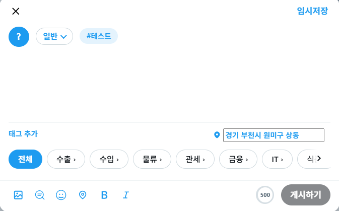
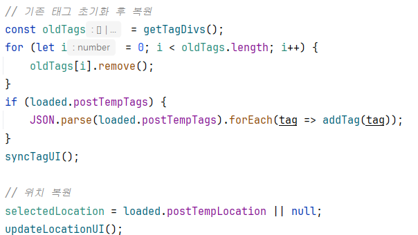
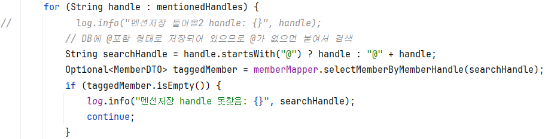

# GlobalGates

> **글로벌 무역 비즈니스 SNS 플랫폼**
> 
> 자유로운 피드 기반 SNS 와 B2B/B2C 무역 플랫폼입니다.

---

## 1. 기획 배경

### 한국 무역 시장은 성장하지만, 중소기업은 정체

- 한국 수출액은 2000년 약 **1,723억 달러** → 2025년 약 **7,093억 달러**로 25년간 **4배 이상 성장** (관세청 수출입무역통계)
- 그러나 성장의 대부분은 **대기업이 흡수**하며, 중소기업의 상대적 위치는 오히려 약화
- 중소기업 수출 비중: **2009년 21.1% → 2024년 16.2%** (약 -5%p)
- 중소기업의 절대 수출액은 768억 → 1,110억 달러로 늘었지만, 전체 시장에서의 점유율은 지속 하락

### 중소기업 해외진출의 1순위 애로사항 — 바이어 발굴

여러 조사에서 일관되게 같은 결론이 나옵니다.

- 국내 기업의 해외 진출 의지: **약 98%** — 한국제약바이오헬스케어연합회 제6차 포럼
- 한국무역협회: 서비스업 해외진출 애로사항 **1위 = "바이어 발굴"** (2020)
- 머니투데이: 벤처·스타트업 **72%**가 "해외 진출 시 바이어 발굴이 가장 어렵다"
- 2023년 중소기업 해외진출 실태조사: 바이어 정보 부족, 발굴 비용, 전문 인력 부족이 공통적 애로사항

수요(해외진출 의지 98%)는 충분히 있지만,  
**국내 중소기업과 해외 바이어를 연결할 효율적 채널이 부족**하다는 것을 확인할 수 있습니다.

### → GlobalGates

GlobalGates는 무역 기반 비즈니스 소셜 마켓 플랫폼으로, 국내 기업과 해외 바이어를 **피드 기반 SNS**형태로 직접 연결합니다. 

---

## 2. 데이터 분석 — 중소기업 수출 정체 확인

> **목적**: "한국 무역 시장은 성장하지만 중소기업은 정체된다"는 기획 가설을 KOSIS 공공데이터로 정량 검증

### 분석 데이터

| 데이터 | 활용 |
| --- | --- |
| 수출입 총괄 (2000~2025) | 전체 무역시장 성장 추이 확인 |
| 지역별 중소기업 수출 (2009~2025) | 기업 유형별 수출 비중 변화 |

`자료출처: KOSIS · 관세청`
---

### 한국 무역 시장은 25년간 4배 이상 성장


→ 2008년의 글로벌 규모의 경제위기, 2015년 시점의 경제위기와 더불어 메르스 창궐,  
2019년의 코로나19로 인한 범지구적 경제적 위기를 겪은 연도를 제외하고는 대한민국의  
수입수출 경제시장은 크게 성장. 2000년 약 **1,723억 달러** → 2025년 약 **7,093억 달러**로 4배 이상 확대.

---

### 성장의 대부분은 대기업이 흡수


→ 대기업 라인이 총 수출 라인과 거의 같은 기울기로 상승하는 반면,  
중소기업·중견기업 라인은 1,000억 달러 부근에서 거의 정체. **시장 전체 성장의 대부분은 대기업이 흡수**하고 있음.

---

### 그에 반해 중소기업 비중은 오히려 감소


→ 2009년 **21.1%** → 2024년 **16.2%**로 약 **-5%p** 감소.  
중소기업의 절대 수출액은 768억 → 1,110억 달러로 늘었지만, 시장 점유율 관점에서는 지속적으로 후퇴.

---

### 분석 결과

| 지표 | 2009년 | 2024년 |
| --- | --- | --- |
| 한국 총수출 | 약 3,635억 달러 | 약 6,836억 달러 |
| 중소기업 수출 | 약 768억 달러 | 약 1,110억 달러 |
| **중소기업 비중** | **21.1%** | **16.2%** |

→ 시장은 성장하지만 중소기업의 상대적 위치는 약화 → **바이어 발굴·시장 정보 비대칭 해소**가 문제인것을 볼 수 있었습니다.

---

## GlobalGates ERD


---

## 백엔드 담당업무


---

## 디버깅

1. 임시저장 글의 태그·위치 정보 유실

- 문제된 상황

  게시글 작성 중 임시저장을 하면 본문만 저장되고 태그·위치정보가 사라짐.  
  이후 다른 글을 작성하다 임시저장 목록에서 이전 글을 불러오면,  
  본문은 복원되지만 현재 작성 중이던 태그·위치가 그대로 남아 섞이는 문제 발생.  



- 해결
 


  임시저장 시 본문만 다루던 로직이 원인.  
  tbl_post_temp 테이블에 location, tag 컬럼을 추가하고 VO, DTO 에도 필드를 추가.  
  태그와 위치를 같이 저장하고, 불러올때 기존 태그, 위치를 초기화한 뒤에 복원하도록 수정.  
  - 임시저장한 글을 불러와도 태그, 위치가정확히 복원됨.  
  - 다른 글 작성 중 불러와도 이전 내용이 섞이지 않음.  

  ---
2. 멘션시 대상 회원을 찾지 못함

- 문제 상황

  게시물 작성 과정에 @로 멘션해 게시글을 작성하면 멘션이 저장되지 않음.  
  오류 없이 "handle 못찾음" 로그 출력.  

- 해결



  DB의 member_handle 은 @amugae 처럼 @를 포함한 형태로 저장되어 있는데,  
  멘션 저장 로직에서 @를 제거한 amugae 로 조회해 일치하는 회원이 없었음.  
  @를 제거하지 않고, 없으면 오히려 @를 붙여 DB 형식에 맞춰 조회하도록 수정.  
  - @amugae  멘션이 정상적으로 회원과 매칭되어 저장됨.  

  ---
3. 구독 결제 정보가 저장되지 않음

- 문제 상황  
  구독 시 tbl_subscription 에는 정상 저장되지만 tbl_payment_subscribe 에는 저장되지 않음.  
  서버 콘솔창 확인 결과 결제 금액 amount 가 null 로 들어옴.  


- 해결
```js
body: JSON.stringify({  
    subscriptionId: subscriptionId,  
    amount: bootpayResponse.price,  
    paymentMethod: bootpayData.method_origin || bootpayData.method || "",  
    receiptId: bootpayData.receipt_id || "",  
    paidAt: bootpayData.purchased_at || null,  
}),
```
의 `amount: bootpayResponse.price,` 를 `amount: bootpayResponse.price || plan.amountValue,` 로 수정하였다.

  결제 저장시 amount 에 bootpayResponse.price 를 넣었으나 null 전달.  
  plan.amountValue 로 항상 금액이 들어가도록 수정.  
  - 구독 시 tbl_payment_subscribe 에 결제 금액이 잘 저장됨.

---

## AI

| AI모델 | 기능 요약 | 사용 기술 |
| --- | --- | --- |
| 태그 추천 | 형태소 분석 + 사전 학습 모델로 광고 태그 제안 | Konlpy Okt |
| 조회수 예측 | TF-IDF 유사도 기반 가중평균으로 신규 게시글 조회수 추정 | TF-IDF · Cosine Similarity |
| 피드 챗봇 | FAISS RAG + Redis 시맨틱 캐시로 피드 기반 대화 응답 | LangChain · FAISS · Redis |

---

### AI-1. - 광고 등록 시, 태그 예측: Okt, CountVectorize, MultinomialNB

> **기능**: 광고를 등록하는 동안 광고의 제목과 본문을 분석해 어울리는 태그 3개를 즉시 제안

광고를 등록, 신청하는 과정에서 제목과 본문을 분석해 어울리는 태그를 예측하는 모델.  
사전에 학습된 분류 모델(`pkl/ad_tag_model.pkl`)과 LabelEncoder(`pkl/ad_tag_encoded.pkl`)를 가져와서,  
형태소 분석으로 추출한 명사를 입력 피처로 사용한다.

#### 작동

- Konlpy Okt 기반 한국어 명사 추출
- `predict_proba` 결과 정렬 후 상위 3개 태그 반환
- LabelEncoder를 이용한 클래스 → 태그 이름 매핑

#### 코드

`post_contents = " ".join(self.okt.nouns(post_contents))`

제목과 본문을 합친 텍스트에서 한국어 명사만 추출해 학습 당시 입력 형식과 동일하게 맞춤.

`proba = self.model.predict_proba([post_contents])[0]`

분류 모델로 각 태그별 확률을 계산한 뒤, 내림차순 정렬해 상위 3개 클래스를 LabelEncoder로 태그 단어에 매핑함.

---

### AI-2. - 게시글 등록 시, 예상 조회수 분석: TFIDF, 벡터 유사도

> **기능**: 작성 중인 글이 게시되었을 때의 예상 조회수를 미리 보아 이용자가 가늠하도록 함.

작성 중인 글과 가장 비슷한 기존 게시글들을 찾아 그 조회수를 가중 평균하여 예상 조회수를 추정한다.  
서버 실행시 `피드목록` 에서 게시글들을 모두 읽어와 TFIDF로 미리 구축해 두고,  
요청이 들어오면 새 글을 동일하게 변환해 코사인 유사도를 계산합니다.

#### 작동

- FASTAPI 부팅시 active 상태의 게시글을 DB에서 로드한 뒤 TFIDF 벡터화
- 본문 + 태그를 합쳐 명사 단위로 토큰화
- 코사인 유사도 상위 5개 게시글 추출
- 유사도 점수를 가중치로 한 조회수 가중평균
- 예상 조회수, 최대/최소 조회수 함께 반환

#### 코드

`sim_scores = cosine_similarity(new_post_matrix, self.tfidf_matrix)`

새 글의 TF-IDF 벡터와 부팅 시 만들어둔 기존 피드 사이의 코사인 유사도를 한 번에 계산함.

`sim_indices = sim_scores.argsort()[0][::-1][:5]`

유사도 점수를 내림차순 정렬해 가장 비슷한 상위 5개 게시글의 인덱스를 뽑아낸다.

`predicted_view_count = np.dot(new_post_sim_scores, sim_view_counts) / new_post_sim_scores.sum()`

상위 5개 유사 게시글의 실제 조회수를 유사도 점수로 가중평균하여 새 글의 예상 조회수를 산출한다.

---

### AI-3. - 지능형 피드 큐레이션 및 답변 생성: Generative Search, Context-Aware 리트리벌

> **기능**: 최근 피드에 어떤 이야기가 오가는지를 질문 한 번으로 확인 하도록 보조

사이트에 올라온 피드를 활용해 사용자의 질문에 답하는 RAG 챗봇으로,  
LangChain + FAISS로 벡터스토어를 구성하고, Redis를 활용한  
시맨틱 캐시로 비슷한 질문은 LLM 호출 없이 즉시 응답한다.

#### 작동

```
[1] 피드 본문 로드 (DB → feed_contents.txt)
    ↓
[2] RecursiveCharacterTextSplitter 로 200자 청크 분할
    ↓
[3] 한국어 임베딩 (jhgan/ko-sbert-nli, 싱글톤 공유)
    ↓
[4] FAISS 벡터스토어 생성 + retriever
    ↓
[5] PromptTemplate (친근한 구어체 응답 가이드)
    ↓
[6] 체인 (retriever → 프롬프트 → LLM → 문자열)
    ↓
[7] Redis 시맨틱 캐시: 유사 질문이면 LLM 호출 생략
```

- FASTAPI 부팅시 피드 본문을 `feed_contents.txt`라는 파일로 저장
- `RecursiveCharacterTextSplitter`로 200자 청크 분할
- FAISS 벡터스토어 생성 및 retriever 구성
- HuggingFace 한국어 임베딩 모델(`jhgan/ko-sbert-nli`)
- 친근한 구어체 응답을 유도하는 PromptTemplate 적용
- Redis 시맨틱 캐시로 유사 질문 캐시 히트 처리 (`cache_score_threshold` 이하)
- 캐시 미스 시 LLM 호출 후 질문·답변을 Redis에 저장
- 응답을 출력

#### 코드

`text_splitter = RecursiveCharacterTextSplitter(chunk_size=200, chunk_overlap=30)`

피드 본문을 200자 단위로 자르되 30자씩 겹치도록 분할해 검색 시 문맥이 잘리지 않도록 한다.

`results = vector_db.similarity_search_with_score(question, k=1)`

Redis 시맨틱 캐시에서 현재 질문과 가장 비슷한 과거 질문 1개를 거리 점수와 함께 가져온다

`if results and results[0][1] <= settings.cache_score_threshold:`

거리 점수가 임계치 이하이면 캐시 히트로 판정해 LLM 호출을 생략하고 저장된 답변을 그대로 반환한다.

`result = await self.feed_chain.ainvoke(question)`

캐시 미스 시 RAG 체인을 비동기 실행해 피드 컨텍스트를 근거로 답변을 생성한다.

---

## 총평

### 기획

기획 단계에서는 흐름을 충분히 정리했다고 생각했지만, 막상 개발에 들어가니 미처 생각하지 못한 상황이 계속 나왔습니다.  
그때마다 다시 논의하고 수정하면서, 기능을 정의하는 것만이 기획이 아니라 사용자의 행동 경로와 예외까지 함께  
그려보는 것이 진짜 기획이라는 걸 배웠습니다. 모든 경우의 수를 미리 예측하긴 어렵지만, 그만큼 기획과 개발이 긴밀하게  
소통해야 한다는 점을 체감했습니다.

### 협업

처음에는 각자 맡은 부분에 집중하다 보니, 공통으로 영향을 주는 변경 사항이 제때 공유되지 않아 혼선이 생기기도 했습니다.  
이후 작은 변경이라도 바로 공유하고 짧게라도 의견을 맞추는 방식으로 바꾸면서 협업 속도가 눈에 띄게 좋아졌습니다.  
기술수준이 올라간 만큼, 정보를 공유하는 방법도 함께 발전해야 한다는 걸 배운 시간이었습니다.

### 좋았던 점

이전 프로젝트보다 훨씬 다양한 기술을 직접 경험할 수 있어 좋았습니다. FASTAPI 를 통한 AI 연동, Quartz 스케줄러,  
부트페이 결제 등 새로운 기술을 적용하고 배포까지 다뤄보면서, 단순히 코드만 작성하는 것을 넘어  
서비스가 실제로 어떻게 동작하고 운영되는지 전체적인 흐름을 이해할 수 있었습니다. 시야가 한 단계 넓어진 경험이었습니다.

### 아쉬웠던 점

기능 구현과 일정을 맞추는 데 집중하다 보니, 코드를 다듬거나 테스트를 충분히 챙기지 못한 점이 아쉽습니다.  
속도도 중요하지만 완성도와 기록 또한 그만큼 중요하다는 걸 느꼈습니다.  
또한 사이트 내 공통적으로 쓰이는 부분에 대해 팀원들과 의견을 더 나눴으면 어땠을까 하는 점도 아쉬움으로 남습니다.  
다음 프로젝트에서는 더 견고하고 유지보수하기 좋은 구조를 고민하는 개발자로 성장하고 싶습니다.

---

#### 자료출처

- [한국무역협회 — 서비스 업계 해외진출 애로사항 1위 '바이어 발굴'](https://n.news.naver.com/mnews/article/421/0004811057?sid=101)
- [데일리메디 — 한국제약바이오헬스케어연합회 제6차 포럼](https://www.dailymedi.com/news/news_view.php?wr_id=907142)
- [머니투데이 — 벤처·스타트업 72% "바이어 발굴이 가장 어려워"](https://news.mt.co.kr/mtview.php?no=2022062815593839075)
- [2023년도 중소기업 해외진출 실태 및 애로사항 설문조사서 (PDF)](https://grant-documents.thevc.kr/196636_2023%EB%85%84%EB%8F%84+%EC%A4%91%EC%86%8C%EA%B8%B0%EC%97%85+%ED%95%B4%EC%99%B8%EC%A7%84%EC%B6%9C+%EC%8B%A4%ED%83%9C+%EB%B0%8F+%EC%95%A0%EB%A1%9C%EC%82%AC%ED%95%AD+%EC%84%A4%EB%AC%B8%EC%A1%B0%EC%82%AC%EC%84%9C.pdf)
